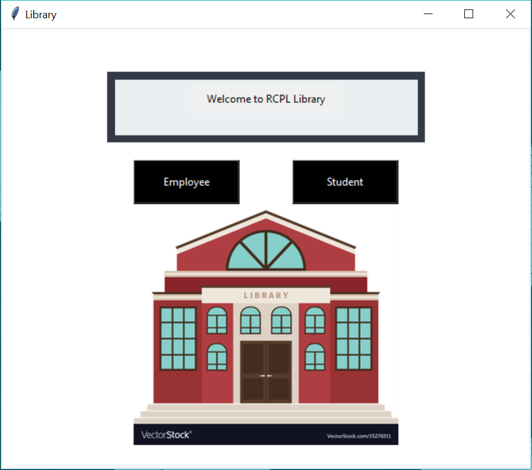
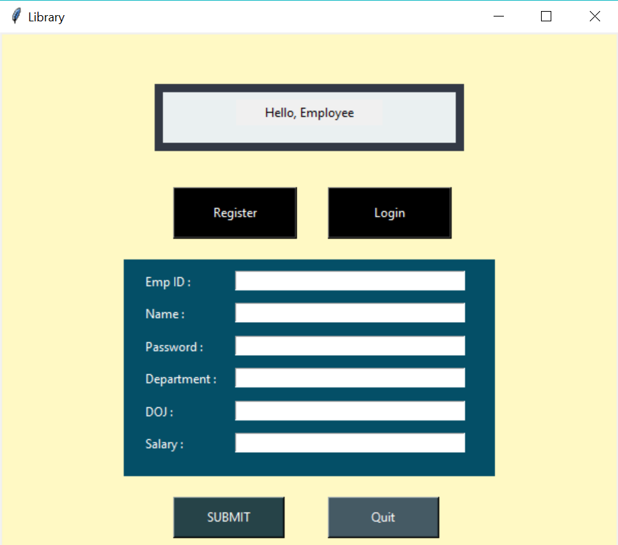
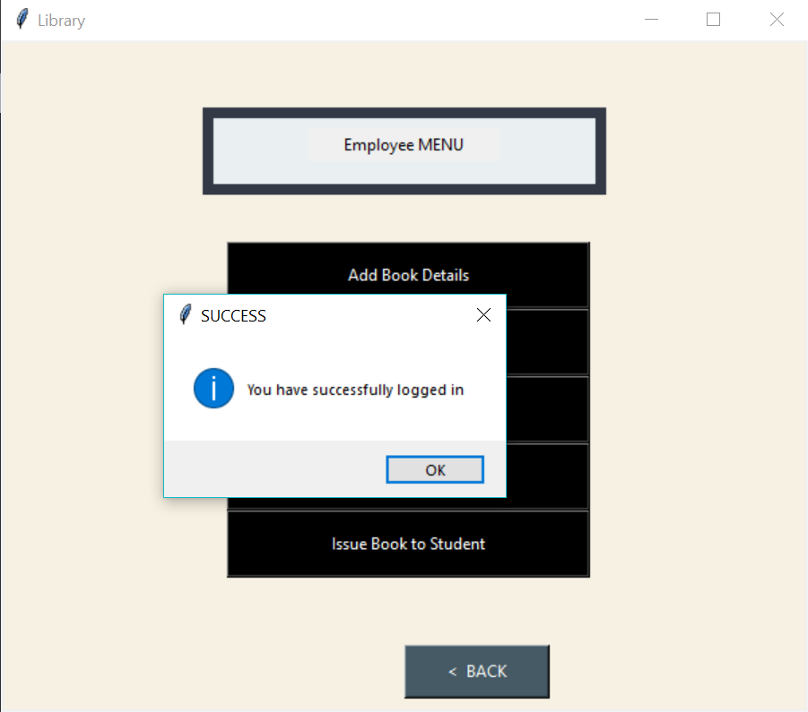
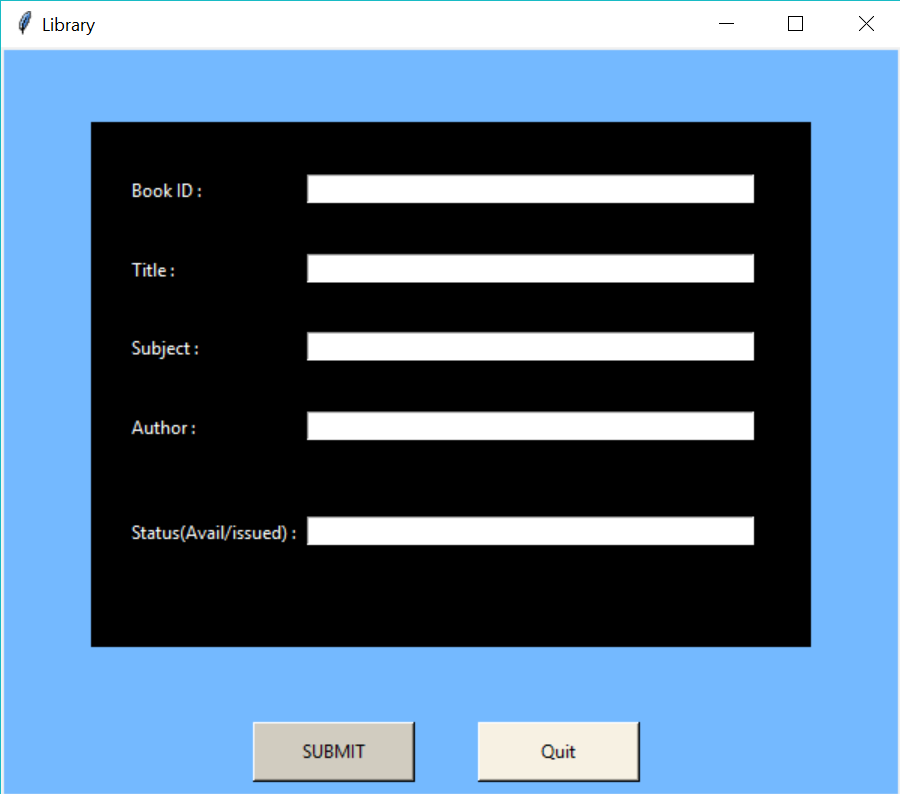
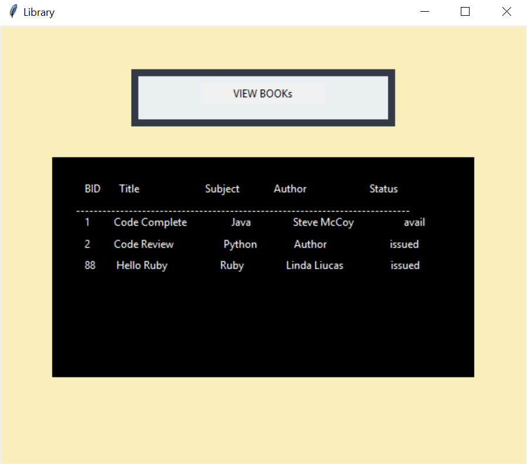
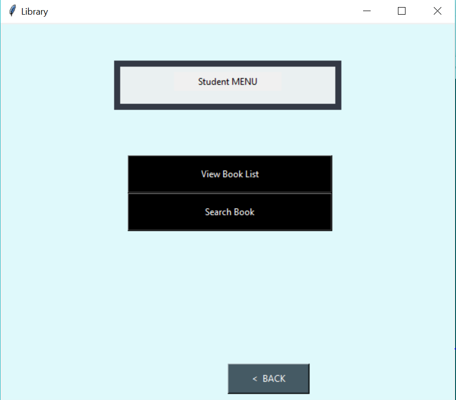

# Library Manager
[](https://GitHub.com/Naereen/StrapDown.js/graphs/commit-activity) [](https://GitHub.com/Naereen/ama) [](https://code.visualstudio.com/) [](https://github.com/S-ayanide/Flutter-SpanishAudio/issues)
[](https://github.com/S-ayanide/Flutter-SpanishAudio/network) [](https://github.com/S-ayanide/Flutter-SpanishAudio/stargazers) [](https://github.com/ellerbrock/open-source-badges/)
[](https://github.com/S-ayanide/Flutter-SpanishAudio/blob/master/LICENSE)

A library management software where you can view all the book present in your library, issue books to student,and do a lot more with it. It also has a portal for both employees and students. 📚
### 👉 If you like this repo then please give it a ⭐️

## Short Description
This is a software which can efficiently manage your library. From performing tasks like viewing all the books to issuing books to students, it can do everything. It has two portals on the homepage, one for Employee and the other for Students. The Employee has all the rights to -
* Add a new book/s
* Delete any book
* View all the books in the library
* Search for any particular subject to list all the books of that subject present in the library
* Issue book to student
Whereas in the Student Portal, they get rights to -
* View all the books
* Search for a specific one

You can either register as an Employee if you haven't done that yet or else just Login like any other portal, same applies to the Student portal. Once you register yourself you will be added to the serveside database from where your details will be fetched at the time of login.

## Screenshots
      
     
## NOTE:
This project is subject to change by the developer and is still in development

## Things you need before getting started --
Install these packages if you don't have them already in your system

	tkinter - pip install tkinter
	Pillow - pip install pillow
	PyMySql - pip install pymysql

Create a database with any name and give your database name and password to-

	main.py - line 21 and 22
	AddBooks.py - line 56 and 57
	DeleteBook.py - line 16 and 17
	IssueBook.py - line 16 and 17
	SearchBook.py - line 16 and 17
	ViewBook.py - line 16 and 17

Create an Employee table with any name and add the following attributes to it -
**empid(PK),name,password,dept,doj,sal (Everything should be varchar) (Please keep the names of the attributes as given here)**

Syntax - `create table <tablename> (empid varchar(20) primary key,name varchar(30),password varchar(30),dept varchar(30),doj varchar(30),sal varchar(30));`

Then go ahead and paste you employee table name to -

	main.py - line 25
	IssueBook.py - line 26

Create a Student table with any name and add the following attributes to it -
**rollno(PK),name,password,dept,sem,batch (Everything should be varchar) (Please keep the names of the attributes as given here)**

Syntax - `create table <tablename> (rollno varchar(20) primary key,name varchar(30),password varchar(30),dept varchar(30),sem varchar(30),batch varchar(30));` 

Then go ahead and paste you student table name to -

	main.py - line 26
	IssueBook.py - line 25

Create a books table with any name and add the following attributes to it -
**bid(PK),title,subject,author,status (Everything should be varchar) (Please keep the names of the attributes as given here)**

Syntax - `create table <tablename> (bid varchar(20) primary key,title varchar(30),subject varchar(30),author varchar(30),status varchar(30));` 

Then go ahead and paste you books table name to -

	AddBooks.py - line 63
	DeleteBook.py - line 23
	IssueBook.py - line 24
	SearchBook.py - line 23
	ViewBooks.py - line 23

Create an issue table with any name and add the following attributes to it -
**bid(PK),issueto,issueby (Everything should be varchar) (Please keep the names of the attributes as given here)**

Syntax - `create table <tablename> (bid varchar(20) primary key,issueto varchar(30),issueby varchar(30));`

Then go ahead and paste you issue table name to -

	IssueBook.py - line 23


##### NOTE: Please give all the passwords unique while registering as it fetches data on the basis of password and if more than one password is same it will throw an exception

## How to run this
Running this is as simple as it gets. Follow this steps
1. Clone this repository
2. Double click on `main.py`

## Pull Request

Pull Requests are welcome. Please follow these rules for the ease of understanding:
* Make sure to check for available issues before raising one
* Give me a maximum of 24-48 hours to respond
* Have proper documentation on the parts you are changing/adding

#### Feel free to contribute

## Developed & Maintained by
[Sayan Mondal](https://github.com/S-ayanide) 
[📷 Insta](https://www.instagram.com/s_ayanide/)
[🐤 Twitter](https://www.instagram.com/s_ayanide/) [](https://twitter.com/intent/tweet?text=Wow:&url=https%3A%2F%2Fgithub.com%2FS-ayanide%2FFlutter-SpanishAudio)

## License 
[](https://github.com/S-ayanide/Flutter-SpanishAudio/blob/master/LICENSE)
```Copyright 2019 Sayan Mondal

Licensed under the Apache License, Version 2.0 (the "License");
you may not use this file except in compliance with the License.
You may obtain a copy of the License at

    http://www.apache.org/licenses/LICENSE-2.0

Unless required by applicable law or agreed to in writing, software
distributed under the License is distributed on an "AS IS" BASIS,
WITHOUT WARRANTIES OR CONDITIONS OF ANY KIND, either express or implied.
See the License for the specific language governing permissions and
limitations under the License.
```

## Getting Started
For help getting started with Flutter, view our online [documentation](https://flutter.dev/docs).
